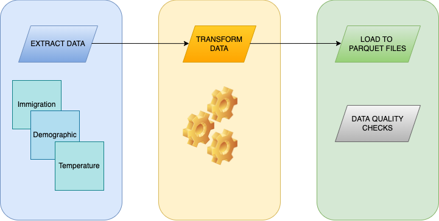
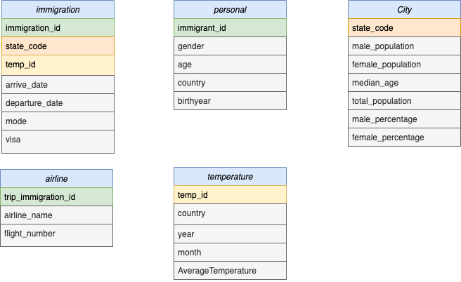

# Data Engineer - Capstone Project

## Overview

This is the Capstone Project is for Udacity Data Engineer nano degree.

In this project, we are going to build a complete ETL pipeline to process information from several sources. The goal is to merge, the information from the sources, process it, and create a data model that helps later to analyze this data. For that purpose, we are going to work with Spark, and the data is:

- Immigration: specific information about every people that entry to EEUU
- Cities: demographic information about cities and states.
- Temperature: global temperature around the world, has been measured monthly.

With these datasets, we are going to build the data model and ETL. The final purpose is to help analytical people understand why those travelers come in that moment of the year, taking into account the temperature from the origin country, and also the temperature at that moment in the United States. Besides, demographic information can be added to this analysis where we can take into account the age of the traveler, the median age of state that is visited, and also the total population or percentage male/female.

The project follows the following steps:
* Step 1: Scope the Project and Gather Data
* Step 2: Explore and Assess the Data
* Step 3: Define the Data Model
* Step 4: Run ETL to Model the Data
* Step 5: Check data quality
* Step 6: Complete Project Write Up

---
## DataSet

There are three datasets, in SAS format and CSV:

- I94 Immigration. This data comes from the US National Tourism and Trade Office and is basically records from international visitors to US. These records store information such as arrival and departure date, visa, mode, and personal information of the passenger as it could be gender, country and age. [Link to source](https://travel.trade.gov/research/reports/i94/historical/2016.html)

- Temperature: This file contains the average temperature of each month and by city. [Link to source](https://www.kaggle.com/berkeleyearth/climate-change-earth-surface-temperature-data)

- Demographic: This file contains demographic information about US cities. This demographic information has some fields as the race, gender majority, median age, etc. [Link to source](https://public.opendatasoft.com/explore/dataset/us-cities-demographics/export/)

---
## ETL Pipeline
ETL pipeline has the following steps:

1. Load data from sources.
2. Analyze, and clean data from nulls values.
3. Transform some data types.
4. Remove not necessary data.
5. Create fact and dimesion tables.
6. Save tables in parquet for downstream query 
7. Check quality data.

---
## Data Model

The data model is a star schema based on the immigration data and with aggregate information about demographic and global temperature. Also, the information is breakdown into different tables for an easier understanding.

---
## Data quality checks

1. Check every table has been created following the schema designed
2. Check that every table has been filled
3. Check not duplicated primary key
